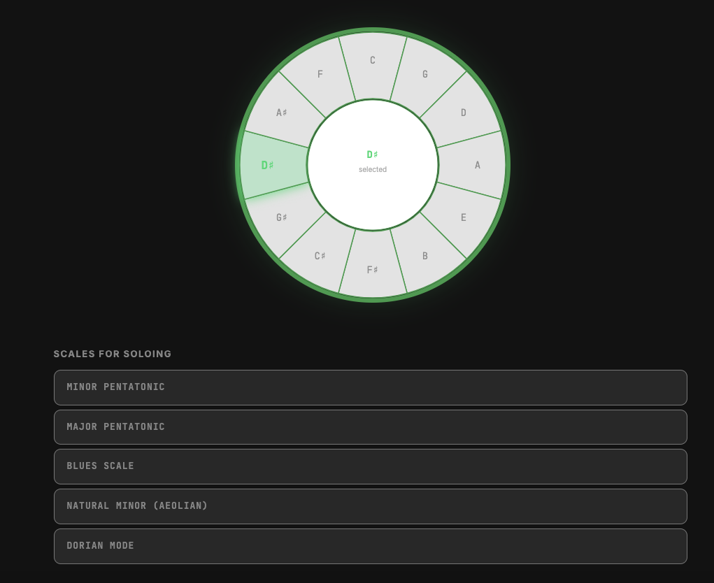
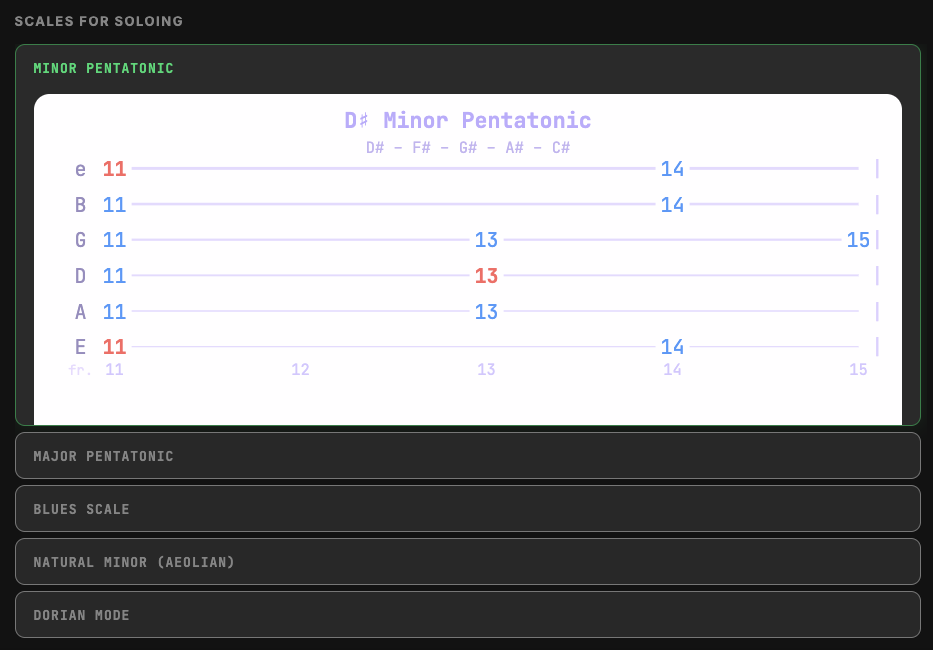

# PopSolo 🎸

A Rails 8 app that uses the circle of fifths to find guitar scales for soloing in any key. Scale tab diagrams (guitar tablature) are stored in Amazon DynamoDB.




---

## Stack

| Layer     | Technology               |
|-----------|--------------------------|
| Frontend  | HTML/CSS (dark theme), inline SVG |
| Backend   | Ruby on Rails 8.1        |
| Database  | Amazon DynamoDB          |
| Ruby      | 4.0+ (Homebrew)          |

---

## AWS Setup (one-time)

### 1 — Create an IAM user

In the AWS Console → IAM → Users → Create user:

- **Name:** `popsolo-app`
- **Permissions:** Attach the managed policy `AmazonDynamoDBFullAccess`
  (or create a custom policy scoped to just the `popsolo_scales` table)
- Generate **Access keys** → save the key ID and secret

### 2 — Create a `.env` file

```sh
cp .env.example .env
```

Edit `.env` and fill in your credentials:

```
AWS_ACCESS_KEY_ID=AKIA...
AWS_SECRET_ACCESS_KEY=...
AWS_REGION=us-east-1
DYNAMODB_TABLE=popsolo_scales
```

> **Never commit `.env` to git.** It is in `.gitignore` by default.

### 3 — Create the DynamoDB table and seed scale data

```sh
bin/rails dynamodb:setup
```

This is idempotent — safe to run more than once. It will:
1. Create the `popsolo_scales` table (on-demand billing, no capacity to manage)
2. Write 60 records (12 keys × 5 scale types) with guitar tab SVGs

---

## Local Development

```sh
# Install dependencies
bundle install

# Start the server (uses Homebrew Ruby)
PATH="/usr/local/lib/ruby/gems/4.0.0/bin:/usr/local/opt/ruby/bin:$PATH" bin/rails server
```

Then open `http://localhost:3000`.

---

## Adding Ruby to your PATH permanently

Add to your `~/.zshrc`:

```sh
export PATH="/usr/local/lib/ruby/gems/4.0.0/bin:/usr/local/opt/ruby/bin:$PATH"
```

Then `source ~/.zshrc` and you can use `rails`, `bundle`, etc. without the prefix.

---

## Data model

**Table:** `popsolo_scales`

| Attribute   | Type   | Description                          |
|-------------|--------|--------------------------------------|
| `key_name`  | String | Partition key — e.g. `"A"`, `"F#"`  |
| `scale_type`| String | Sort key — e.g. `"minor_pentatonic"` |
| `notes`     | String | Human-readable note list             |
| `svg_data`  | String | Inline SVG guitar tab diagram        |

### Scale types

| `scale_type`      | Display name            |
|-------------------|-------------------------|
| `minor_pentatonic`| Minor Pentatonic        |
| `major_pentatonic`| Major Pentatonic        |
| `blues`           | Blues Scale             |
| `natural_minor`   | Natural Minor (Aeolian) |
| `dorian`          | Dorian Mode             |

---

## Deploying to EC2

1. Launch an Amazon Linux 2023 or Ubuntu 24.04 instance
2. Install Ruby 4 (via rbenv or system package)
3. Clone this repo and `bundle install`
4. Set environment variables (use AWS IAM role instead of static keys for EC2)
5. Run `bin/rails dynamodb:setup` once to populate the table
6. Start Puma: `bin/rails server -b 0.0.0.0 -p 80` (or use nginx + systemd)

**Tip:** On EC2, attach an IAM role with `AmazonDynamoDBFullAccess` to the instance instead of using static credentials — then you can omit `AWS_ACCESS_KEY_ID` / `AWS_SECRET_ACCESS_KEY` entirely.
